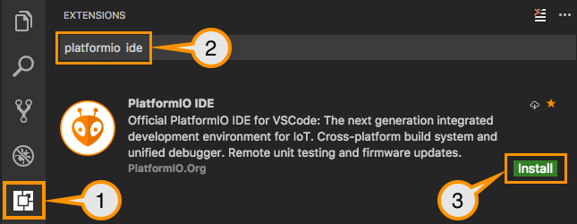

# IDE Preparation

- [Download and install official Microsoft Visual Studio Code](https://code.visualstudio.com/). PlatformIO IDE is built on top of it.
- Open the extension manager.
- Search for the official `platformio ide` extension.
- Install PlatformIO IDE extension.



# Usage

1. Setup new VSCode PlatformIO project.
1. Configure a platform option in [platformio.ini](https://docs.platformio.org/page/projectconf.html) file:

***pioarduino*** supports Espressif Arduino-esp32 core version 3.0.4 and Espressif IDF version 5.1.4

## Environment Links

See the PlatformIO [platform documentation](https://docs.platformio.org/en/latest/projectconf/sections/env/options/platform/platform.html#projectconf-env-platform) for details.

### Stable version

```ini
[env:stable]
platform = https://github.com/pioarduino/platform-espressif32/releases/download/51.03.04/platform-espressif32.zip
board = ...
```

### Development version

espressif Arduino repo branch master and latest compiled Arduino libs

```ini
[env:development]
platform = https://github.com/pioarduino/platform-espressif32.git#develop
board = ...
```

# Configuration

Please navigate to [the PlatformIO documentation page](https://docs.platformio.org/page/platforms/espressif32.html).


# Additional Configuration

Please see [Official PlatformIO Documentation](https://docs.platformio.org/page/platforms/espressif32.html) for advanced usage, packages, boards, frameworks, etc.

# Issues with boards

All issues caused from boards (wrong / missing) will ***not*** be fixed by the maintainer(s).

A PR needs to be provided to solve.